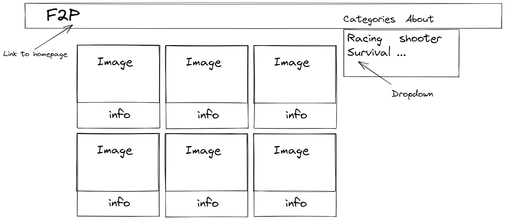
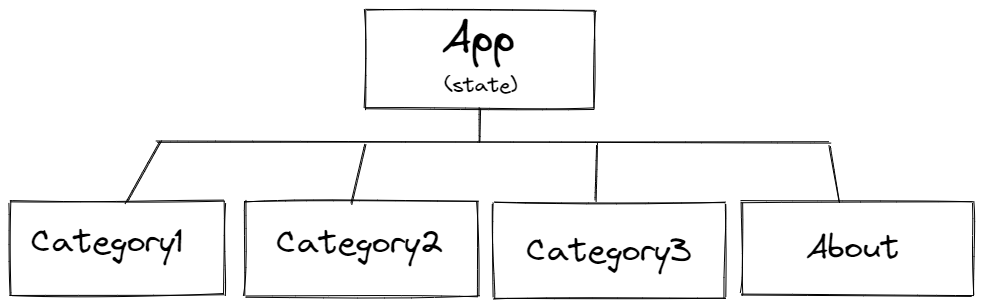

# Project 2 Proposal
## Description
Using and API from https://www.freetogame.com/api-doc , I will make a site that lists free to play games, and when you click on them, you will get details about the game.

## Wireframes

**MVP User Stories**
  - User should be able to see cards with each game on main page
  - User should be able to click on any card and it should expand with more details
  - User should be able to click on a "more into" button and be taken to a more detailed page
  - User should be able to click on navigation to return to the main page
  **MVP Stretch**
  - User should be able to choose between categories in nav

## API
https://www.freetogame.com/api-doc

## Component Hierarchy

## Link to my deployed project
https://project2dannyg.netlify.app/